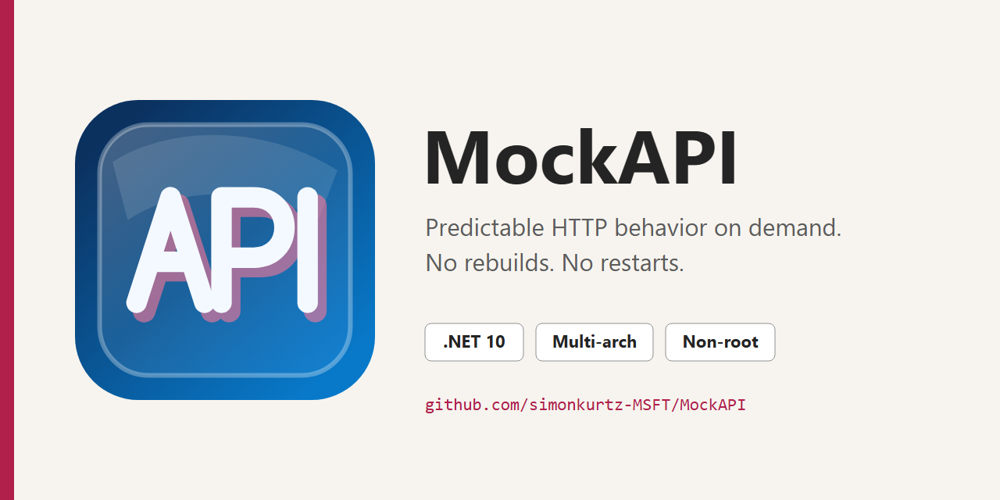

# MockAPI



Project planning is tracked in [docs/PLAN.md](docs/PLAN.md). Local container development uses WSLC; see [docs/WSLC.md](docs/WSLC.md) for verified commands, supported checks, and the CI boundary for multi-architecture releases.

## Prerequisites

- Windows with PowerShell 7 and WSLC for the supported local container workflow.
- The .NET SDK version pinned in [global.json](global.json) for managed-code development.
- Node.js from [.nvmrc](.nvmrc) with Corepack and the pnpm version declared in [package.json](package.json) for formatting and Markdown linting.

Run the setup check from a clean checkout:

```powershell
.\start.ps1 -Action setup
```

Pass `-InstallMissing` only when the script may install the .NET SDK through winget or update WSL.

## Quick Start

Run directly with .NET:

```powershell
.\start.ps1 -Action run
```

Open the address printed by ASP.NET Core. For a persistent container on `http://localhost:8080/`:

```powershell
.\start.ps1 -Action container-build
.\start.ps1 -Action container-run
.\start.ps1 -Action container-test
```

In the dashboard, select **Load examples**. This adds only missing examples and preserves unrelated configuration. Invoke `GET /ex/hello`, edit an endpoint, select **Save**, then stop and restart the container to verify that the `mockapi-data` volume retained the change.

## Small Container Footprint

The current native `linux/arm64` validation image is only **28.10 MB** as reported by WSLC, with an estimated **14.98 MB gzip-compressed layer payload**. The self-contained, fully trimmed application runs in the minimal .NET runtime-deps image without carrying the SDK, shared .NET framework runtime, debug symbols, Node.js, browser binaries, tests, or development manifests. See the [measured image footprint](docs/WSLC.md#measured-image-footprint) for the exact baseline and methodology.

## Developer CLI

Run the root developer CLI interactively:

```powershell
.\start.ps1
```

Common automation-friendly actions:

```powershell
.\start.ps1 -Action setup
.\start.ps1 -Action format
.\start.ps1 -Action lint
.\start.ps1 -Action test
.\start.ps1 -Action coverage
.\start.ps1 -Action validate
.\start.ps1 -Action container-build
.\start.ps1 -Action container-run
.\start.ps1 -Action container-test
.\start.ps1 -Action container-showcase
```

Phase 7 quality checks are development-only and never enter the runtime image:

```powershell
pnpm run test:frontend:coverage
pnpm run test:browser:smoke
pnpm run test:browser
```

Backend and extracted frontend production scopes enforce 100% line and branch coverage. Generated serializers, compiler output under `obj`, and browser orchestration are validated separately and are not used to dilute the coverage denominator.

Playwright starts an isolated MockAPI process on port `8091` with a temporary configuration under `artifacts/`; it does not modify the development container or persisted configuration. See [Accessibility verification](docs/ACCESSIBILITY.md) for the automated and manual WCAG 2.2 AA evidence requirements.

`setup` checks the pinned .NET SDK, pnpm, and WSLC, then restores the development dependencies. `format` applies Prettier and `dotnet format`; `lint` verifies formatting, Markdown, and managed code style. Pass `-InstallMissing` to explicitly permit .NET installation through winget or a WSL update when a prerequisite is missing. Run `.\start.ps1 -Action help` for every action and option.

The WSLC container workflow builds the native host architecture, publishes port `8080`, applies the `0.5` CPU and `256 MiB` limits, and mounts the persistent `mockapi-data` volume at `/data`. `container-run` creates the container when absent and restarts it when stopped. Multi-platform image assembly and the checks unsupported by WSLC remain CI responsibilities.

## Configuration File

MockAPI loads and validates its configuration before serving requests. In containers, the default path is `/data/mockapi.json`; in local Development it is `mockapi.json` under the application content root. A missing file starts with an empty configuration by default. The checked-in `config/mockapi.template.json` is empty. `config/mockapi.json` contains four examples under `/ex/`: a `200` hello response, `201` order creation, `204` deletion, and a repeated-header `429` response.

Set these environment variables to override that behavior:

```text
MockApi__ConfigurationPath=/data/mockapi.json
MockApi__AllowEmptyConfiguration=false
MockApi__EnableManagementApi=true
MockApi__EnableDashboard=true
MockApi__EnableOpenApi=true
MockApi__EnableSwaggerUi=true
MockApi__ManagementPermitLimit=120
```

Malformed, oversized, or semantically invalid configured files fail startup without activating a partial configuration. Runtime edits remain in memory until an explicit save operation atomically replaces the configured file.

Each exposure switch is independent. `EnableManagementApi=false` disables management operations, the OpenAPI document, and Swagger UI while configured mock routes, health checks, and an independently enabled dashboard remain available. The dashboard requires the management API for editing and live data.

## Administrative Dashboard

The administrative dashboard is served at `/`. It provides endpoint creation, editing, duplication, enablement, deletion, filtering, configuration import/export/save, built-in template and example loading, an endpoint test blade, aggregate statistics, per-endpoint statistics, and reset operations. Statistics can be viewed as tables or 60-minute activity graphs. Per-endpoint graphs annotate why the observed response is expected from the active configuration; for example, a fixed `429` response is identified as configured behavior, including its `Retry-After` value, without claiming that a request-count or time-window limiter exists. Loading a built-in merges only missing endpoints, skips identical endpoints, and never removes unrelated configuration. Divergent endpoints produce a conflict preview and require an explicit forced update. Statistics update through server-sent events with periodic HTTP polling as a fallback.

After loading the examples, run `./start.ps1 -Action container-showcase` to verify the rate-limit response, query-insensitive matching, negative routes, and statistics deltas against the running container. The showcase never imports or modifies configuration.

The root path is reserved and cannot be configured as a mock endpoint. Set `MockApi__EnableDashboard=false` to disable static dashboard assets and the root application route.

## Management API

Management operations are available under `/__mockapi/api`:

| Area          | Routes                                                                                                                                                                                                                                     |
| ------------- | ------------------------------------------------------------------------------------------------------------------------------------------------------------------------------------------------------------------------------------------ |
| Endpoint CRUD | `/endpoints`, `/endpoints/{id}`, `/endpoints/{id}/enabled`                                                                                                                                                                                 |
| Configuration | `/configuration`, `/configuration/template`, `/configuration/example`, `/configuration/template/merge`, `/configuration/example/merge`, `/configuration/validate`, `/configuration/import`, `/configuration/export`, `/configuration/save` |
| Statistics    | `/statistics`, `/statistics/events`, `/statistics/reset`, `/statistics/endpoints/{id}/reset`                                                                                                                                               |

Create, replace, enable/disable, delete, import, and save requests require the latest quoted ETag in `If-Match`; stale writes return HTTP `412` without changing the active configuration. Successful changes are immediately visible to the mock dispatcher and remain unsaved until save is explicitly invoked.

The management OpenAPI document is available at `/__mockapi/openapi/v1.json`, and Swagger UI is at `/__mockapi/swagger`. Runtime-defined mock endpoints are intentionally excluded. Set `MockApi__EnableOpenApi=false` or `MockApi__EnableSwaggerUi=false` to disable either exposure independently.

Liveness and readiness probes are available at `/health/live` and `/health/ready`.

The management API and dashboard have no authentication. Keep them on localhost or a protected network, or disable their exposure while leaving configured mock routes available.

## Documentation

- [Configuration reference](docs/CONFIGURATION.md)
- [Management API and ETags](docs/MANAGEMENT_API.md)
- [Operations, security, containers, and local HTTPS](docs/OPERATIONS.md)
- [Accessibility statement and verification](docs/ACCESSIBILITY.md)
- [Troubleshooting](docs/TROUBLESHOOTING.md)
- [WSLC command reference and measured image footprint](docs/WSLC.md)
- [Implementation plan](docs/PLAN.md)
