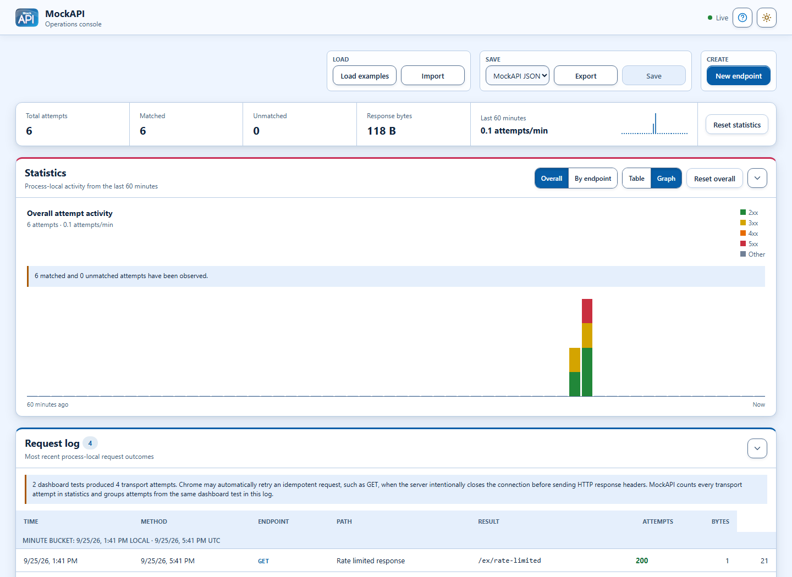
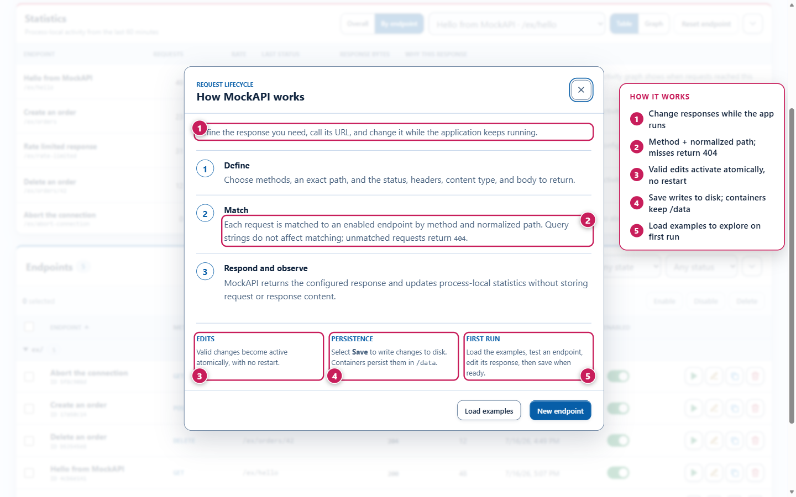
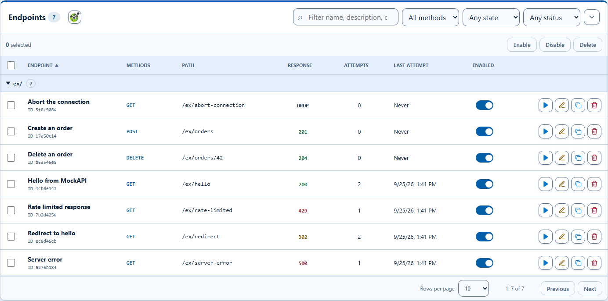
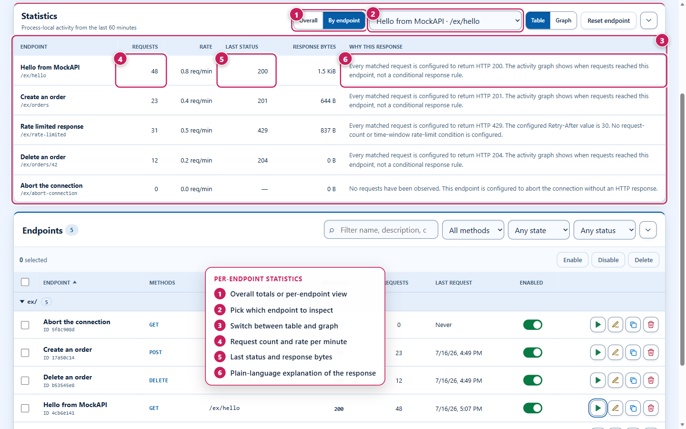
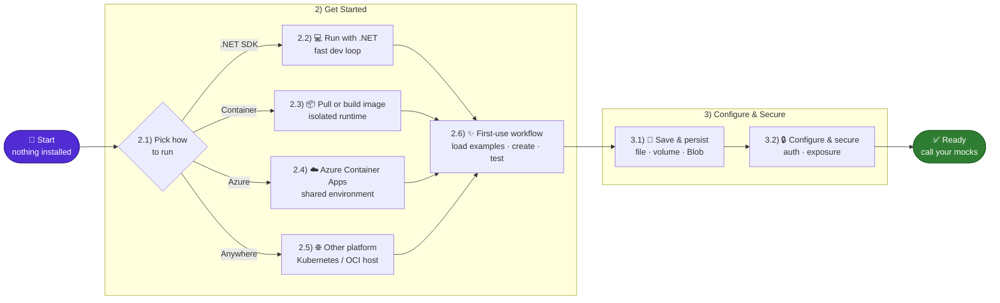
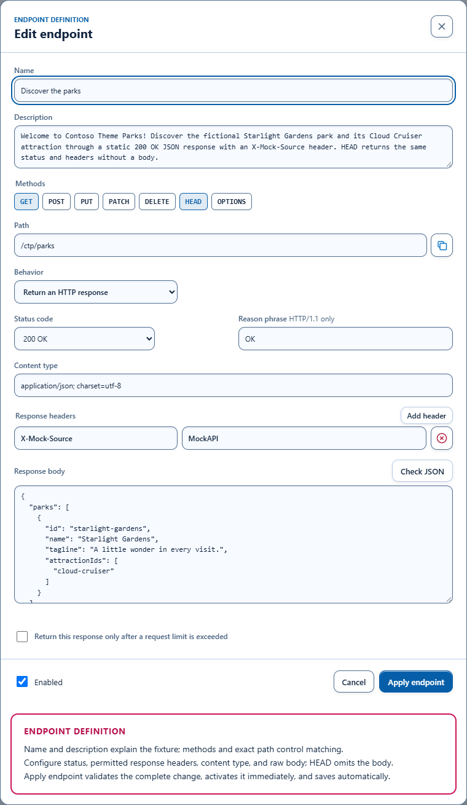
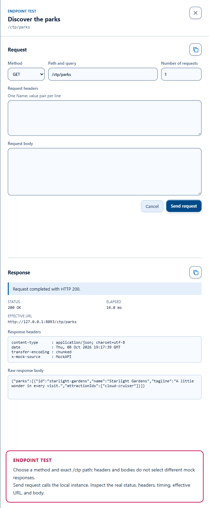
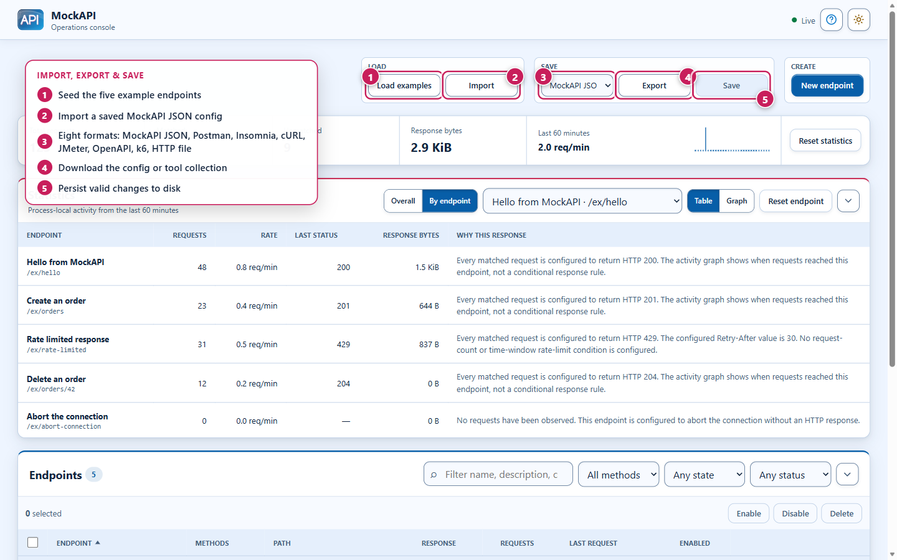

# MockAPI

[](https://hub.docker.com/r/simonkurtzmsft/mockapi)
[](https://hub.docker.com/r/simonkurtzmsft/mockapi/tags)
[](https://hub.docker.com/r/simonkurtzmsft/mockapi/tags)
[](LICENSE)
[](src/MockAPI/MockAPI.csproj)

**Mock any HTTP response — any status code, any headers, any body — and change it while your app keeps running!**

Need a clean `200`, a stubborn `429`, a broken `500`, or a dropped connection on demand? MockAPI serves the exact HTTP response you define — and lets you change it at runtime without touching consumer code or restarting.

**MockAPI is a self-contained .NET 10 mock server.** Define responses in the browser dashboard, the management API, or JSON, then call them immediately. It ships as one small, multi-architecture container available on [Docker Hub](https://hub.docker.com/r/simonkurtzmsft/mockapi) as `simonkurtzmsft/mockapi`, so you can pull, run, or deploy it in seconds. No SDKs, no stub code, no redeploys.

_**From a developer, for developers!**_

## Get started in two minutes

**Recommended: run the current source.** Install the stable [.NET 10 SDK](https://dotnet.microsoft.com/download/dotnet/10.0)
and use PowerShell 7 or Bash. Node.js is not needed just to run MockAPI.

```text
git clone https://github.com/simonkurtz-MSFT/MockAPI.git
cd MockAPI
```

<details open>
<summary><strong>PowerShell 7</strong></summary>

```powershell
$env:ASPNETCORE_URLS = 'http://localhost:5080'
.\start.ps1 -Action run-tutorial
```

</details>

<details>
<summary><strong>Bash</strong></summary>

```bash
export ASPNETCORE_URLS='http://localhost:5080'
./start.sh --action run-tutorial
```

</details>

1. Open **[the dashboard](http://localhost:5080/__mockapi/)** and select **Load examples**.
2. Configure [dashboard administrator credentials](docs/OPERATIONS.md#mock-api-keys), then open
   **Settings > Mock API security** and generate a key. Mock calls fail with `401` until a key is generated.
3. Select **Test** on `/ex/hello`. Dashboard tests use the generated key automatically.
   External callers must send it in `X-MockAPI-Key`; opening a mock URL without that header returns `401`.
4. Edit its response in the dashboard and repeat the test. No restart needed.
5. Changes are saved automatically to your [writable file or volume](#22-run-directly-with-net). Use **Retry save** if saving fails.

Press `Ctrl+C` to stop. [Readiness](http://localhost:5080/health/ready) returns HTTP `200` when the app is ready.
Keep administrative access on localhost or a protected network unless you configure [authentication and HTTPS](#32-administrative-security).

| Prefer a different path?        | Start here                                                                                                                                   |
| ------------------------------- | -------------------------------------------------------------------------------------------------------------------------------------------- |
| No local toolchain              | [Open in Codespaces](https://codespaces.new/simonkurtz-MSFT/MockAPI) and follow the [private-port development guide](docs/DEVELOPMENT.md)    |
| Container runtime only          | [Published Docker Hub tags](https://hub.docker.com/r/simonkurtzmsft/mockapi/tags) and the [container quick start](#23-run-a-local-container) |
| Contribute or prepare a release | [Development container](docs/DEVELOPMENT.md) · [Versioning and approved publication](docs/RELEASING.md)                                      |

> [!IMPORTANT]
> MockAPI is pre-1.0. The published `v1.0.0-alpha.1` image is an older preview, not the current beta source.
> Use the source quick start for current features. A version in the project does not mean that image has been published.



The browser dashboard is the operations console: load or import a configuration, watch live request metrics, and manage every mock endpoint in one place.

The dashboard logo and browser favicon use a glassy blue tile with **Mock** above **API**.

## Table of Contents

- [Get started in two minutes](#get-started-in-two-minutes)
- [1) Understand MockAPI](#1-understand-mockapi)
  - [1.1) What Problem Does MockAPI Solve?](#11-what-problem-does-mockapi-solve)
  - [1.2) Common Use Cases](#12-common-use-cases)
  - [1.3) Why MockAPI](#13-why-mockapi)
  - [1.4) When It Is the Right Fit](#14-when-it-is-the-right-fit)
  - [1.5) What It Can Do](#15-what-it-can-do)

- [2) Get Started](#2-get-started)
  - [2.1) Choose How to Run MockAPI](#21-choose-how-to-run-mockapi)
  - [2.2) Run Directly with .NET](#22-run-directly-with-net)
  - [2.3) Run a Local Container](#23-run-a-local-container)
  - [2.4) Deploy to Azure Container Apps](#24-deploy-to-azure-container-apps)
  - [2.5) Deploy the Container Elsewhere](#25-deploy-the-container-elsewhere)
  - [2.6) Complete the First-Use Workflow](#26-complete-the-first-use-workflow)
  - [2.7) Import Mock Endpoints into Azure API Management](#27-import-mock-endpoints-into-azure-api-management)

- [3) Configure and Secure MockAPI](#3-configure-and-secure-mockapi)
  - [3.1) Configuration](#31-configuration)
  - [3.2) Administrative Security](#32-administrative-security)
  - [3.3) Management API](#33-management-api)

- [4) Develop and Validate](#4-develop-and-validate)

- [5) Documentation](#5-documentation)

## 1) Understand MockAPI

### 1.1) What Problem Does MockAPI Solve?

#### 1.1.1) The Dependency Problem

Applications rarely work alone. They call payment providers, identity systems, partner APIs, internal services, and other dependencies that may be unfinished, unreliable, expensive, rate-limited, or difficult to reach from a developer machine or CI runner. Work stops when those systems are unavailable, and testing only the successful response leaves retry, fallback, and error handling unproven.

Teams often work around this by adding temporary stub code, maintaining a disposable service, or waiting for a shared test environment. Those approaches add code that must later be removed, make tests depend on environment state, and still make unusual failures difficult to reproduce on demand.

#### 1.1.2) The MockAPI Approach

MockAPI replaces that dependency with a small HTTP server whose behavior is configuration. Describe the method, path, status, headers, and body that the caller should receive, then change that behavior at runtime without rebuilding either application. The consumer still makes a real HTTP request, but the response is local, controlled, and repeatable.

> [!NOTE]
> The team can keep moving before a dependency is ready, replay the same scenario on demand, and safely exercise failures that would be impractical to trigger against a real service.



Every request follows the same lifecycle: define a response, match it by method and exact path, then respond and record process-local statistics. Valid edits activate atomically with no restart.

### 1.2) Common Use Cases

| Use case                          | How MockAPI helps                                                                                                                            |
| --------------------------------- | -------------------------------------------------------------------------------------------------------------------------------------------- |
| Develop against an unfinished API | Gives frontend, mobile, or service teams a working HTTP dependency while the real provider is still being designed or implemented            |
| Keep integration tests stable     | Runs known responses in CI without relying on internet access, third-party availability, shared test data, or a long-lived test environment  |
| Verify resilience behavior        | Produces precise errors, rate limits, empty bodies, and disconnects to exercise retries, circuit breakers, fallbacks, and user-facing errors |
| Reproduce production defects      | Captures a relevant response as configuration and replays it locally without copying the entire upstream system                              |
| Stabilize demos and workshops     | Keeps workflows predictable when a partner API is unavailable, slow, costly, or unsuitable for demonstration data                            |
| Share an agreed HTTP contract     | Versions representative paths and responses with the consumer for consistent use across local, CI, and shared environments                   |

### 1.3) Why MockAPI

- **Turn expected HTTP outcomes into configuration.** Create normal responses, non-success status codes, repeated headers, empty bodies, conditional `429` rate limits, and connection failures without writing a disposable API.
- **Test the paths that are hardest to reproduce.** Intentionally abort a connection before any HTTP response is sent, or return precise error payloads and headers for retry, fallback, and resilience testing.
- **Make behavior obvious and repeatable.** Matching uses only the HTTP method and exact normalized path. Query strings, headers, and bodies cannot silently select a different response.
- **Edit safely while the server is running.** Valid changes take effect immediately; invalid or stale updates leave the active configuration untouched.
- **Move the same mock between environments.** Run directly with .NET or use the self-contained, non-root Linux container on `amd64` and `arm64`; no Node.js or .NET SDK is required on the container host.
- **Keep test data under your control.** Store configuration in a local file, a container volume, or private Azure Blob Storage, and collect bounded request statistics without retaining request or response content.

### 1.4) When It Is the Right Fit

MockAPI is intentionally narrower than a general-purpose API virtualization platform. **That narrowness is useful when deterministic behavior, simple operation, and a small deployment footprint matter more than request-aware scripting.**

| Choose MockAPI when you need...                                   | Consider another solution when you need...                                       |
| ----------------------------------------------------------------- | -------------------------------------------------------------------------------- |
| Exact method-and-path matching with a configured response         | Matching based on query values, request headers, or request bodies               |
| Runtime editing through a dashboard, API, or versioned JSON       | Dynamic response templating, stateful scenarios, delays, or response sequences   |
| Explicit HTTP errors, conditional `429` responses, or disconnects | Recording and replaying traffic through a proxy                                  |
| One portable service for local, CI, demo, or shared test use      | A generated mock derived from a large API contract or a full simulation platform |
| A focused tool that is easy to inspect, persist, and operate      | Multi-user orchestration or distributed synchronization across replicas          |

**MockAPI is most helpful when you know the response a dependency should produce and want that response available now, consistently, without another service implementation to maintain.**

### 1.5) What It Can Do

#### 1.5.1) Control HTTP Behavior

- **Deterministic routing:** Match enabled endpoints by HTTP method and exact normalized path; unmatched requests return `404`.
- **Precise responses:** Return a configured status code, reason phrase, repeated headers, content type, and exact response body.
- **Resilience scenarios:** Exercise conditional rolling-window `429` responses and intentional connection aborts.

#### 1.5.2) Manage Changes Safely

- **Runtime endpoint management:** Create, edit, duplicate, enable, disable, test, import, export, and save endpoints from the dashboard.
- **Atomic configuration:** Validate a complete candidate before activation so an invalid update never partially changes the active routes.
- **Privacy-conscious activity:** Report aggregate and per-endpoint statistics plus the 100 most recent request outcomes without retaining request or response content, headers, cookies, or query values.

#### 1.5.3) Run Where the Team Works

- **Flexible persistence:** Save configuration to a local file, a container volume, or private Azure Blob Storage.
- **Independent administration security:** Protect mock calls with an instance API key by default, independently
  of optional dashboard and management Basic authentication. Health stays public; security Settings require an administrator.
- **Hardened portable runtime:** Run as a trimmed, non-root Linux container on `amd64` and `arm64`, including with a read-only root filesystem.



The endpoint registry lists every mock with its method, exact path, configured response, and live request count, and offers per-row test, edit, duplicate, and delete actions.



Process-local statistics report aggregate and per-endpoint activity — request counts, rate, last status, and response bytes — with a plain-language note explaining each configured response. The dashboard also shows the 100 most recent request outcomes newest first. It retains only timestamp, method, normalized path, endpoint identity, outcome, status, and response byte count; never request or response content, headers, cookies, or query values.

## 2) Get Started

Proceed in this order:

1. [Choose an execution model](#21-choose-how-to-run-mockapi) based on where MockAPI needs to run.
2. Follow the linked startup instructions for that model.
3. [Complete the first-use workflow](#26-complete-the-first-use-workflow) to create and verify a mock endpoint.
4. Review [configuration and exposure](#3-configure-and-secure-mockapi) before sharing administrative access or persisting configuration.
5. Use the [contributor workflow](#4-develop-and-validate) only when changing MockAPI itself.

From nothing to a running, callable mock in five moves:



### 2.1) Choose How to Run MockAPI

Run commands from the repository root. Developer-CLI examples provide collapsible **PowerShell 7** (`start.ps1`) and **Bash** (`start.sh`) variants; the two entry points expose the same actions and options and are kept in sync. PowerShell is expanded by default. Pure `docker` and `docker compose` commands are identical in both shells and are shown once.

| Workflow                                                        | Best for                                                        | Requirements                                                | Application URL          |
| --------------------------------------------------------------- | --------------------------------------------------------------- | ----------------------------------------------------------- | ------------------------ |
| [.NET directly](#22-run-directly-with-net)                      | Fast local edit, run, and debug loops                           | Current stable .NET 10 SDK                                  | `http://localhost:5080/` |
| [Container](#23-run-a-local-container)                          | Fastest isolated runtime; pull the published image or build it  | WSLC, Docker Engine or Desktop, or a compatible OCI runtime | `http://localhost:8080/` |
| [Azure Container Apps](#24-deploy-to-azure-container-apps)      | A remotely accessible shared environment                        | Azure CLI and Azure Developer CLI 1.27.1 or newer           | Printed after deployment |
| [Other container platforms](#25-deploy-the-container-elsewhere) | Kubernetes, hosted container services, or custom infrastructure | Linux `amd64` or `arm64` container runtime                  | Platform-defined         |

The runtime container is self-contained. Hosts running the image do not need the .NET SDK, Node.js, pnpm, or browser tooling.

### 2.2) Run Directly with .NET

In the interactive CLI, choose **Run locally** (`l`), then **1: Run without tutorial** or **2: Run with tutorial**. Both start MockAPI and open the dashboard once it is ready. The tutorial choice overrides the browser's saved dismissal preference for that URL without clearing other preferences. Direct actions are `.\start.ps1 -Action run` / `./start.sh --action run` (skip the tour) and `.\start.ps1 -Action run-tutorial` / `./start.sh --action run-tutorial` (show the tour). The browser URLs use `?tutorial=skip` and `?tutorial=show`; ordinary dashboard URLs continue to honor the saved first-use preference.

Use this path for the shortest local development loop. Start MockAPI in one terminal; the developer CLI opens the dashboard in your default browser after the application becomes ready. In a second terminal, verify readiness and call the first mock endpoint. Select **Load examples** in the dashboard, and press `Ctrl+C` to stop MockAPI when done.

<details open>
<summary><strong>PowerShell 7</strong></summary>

```powershell
# Terminal 1: start MockAPI and leave it running
$env:ASPNETCORE_URLS = 'http://localhost:5080'
.\start.ps1 -Action run

# Terminal 2: verify readiness, then call the first mock endpoint
Invoke-WebRequest http://localhost:5080/health/ready
Invoke-RestMethod http://localhost:5080/ex/hello -Headers @{ 'X-MockAPI-Key' = $env:MOCKAPI_KEY }
```

</details>

<details>
<summary><strong>Bash</strong></summary>

```bash
# Terminal 1: start MockAPI and leave it running
export ASPNETCORE_URLS='http://localhost:5080'
./start.sh --action run

# Terminal 2: verify readiness, then call the first mock endpoint
curl -fsS http://localhost:5080/health/ready
curl -fsS -H "X-MockAPI-Key: $MOCKAPI_KEY" http://localhost:5080/ex/hello
```

</details>

Direct development starts with an empty configuration unless a configuration path is supplied. To make dashboard saves durable, create a writable copy before starting:

<details open>
<summary><strong>PowerShell 7</strong></summary>

```powershell
New-Item -ItemType Directory -Force artifacts/local-data | Out-Null
Copy-Item config/mockapi.json artifacts/local-data/mockapi.json
$env:MockApi__ConfigurationPath = (Resolve-Path artifacts/local-data/mockapi.json).Path
$env:MockApi__AllowEmptyConfiguration = 'false'
.\start.ps1 -Action run
```

</details>

<details>
<summary><strong>Bash</strong></summary>

```bash
mkdir -p artifacts/local-data
cp config/mockapi.json artifacts/local-data/mockapi.json
export MockApi__ConfigurationPath="$(realpath artifacts/local-data/mockapi.json)"
export MockApi__AllowEmptyConfiguration='false'
./start.sh --action run
```

</details>

Dashboard changes automatically update that working copy. If saving fails, changes stay active but unsaved;
restore write access and select **Retry save**.

### 2.3) Run a Local Container

The fastest way to run MockAPI is to pull the published image from [Docker Hub](https://hub.docker.com/r/simonkurtzmsft/mockapi). No build, .NET SDK, Node.js, or repository checkout is required:

```powershell
docker run --rm -p 127.0.0.1:8080:8080 simonkurtzmsft/mockapi:v1.0.0-alpha.1
```

The tag is a single multi-architecture manifest that supports **`linux/amd64`** and **`linux/arm64`**. Docker automatically selects the image that matches the host architecture, so the same command and tag work on Intel/AMD and ARM hosts. Confirm the available platforms for a tag with:

```powershell
docker manifest inspect simonkurtzmsft/mockapi:v1.0.0-alpha.1
```

Open `http://localhost:8080/`, then [complete the first-use workflow](#26-complete-the-first-use-workflow). Add a named volume to keep dashboard saves across restarts:

```powershell
docker run --rm -p 127.0.0.1:8080:8080 -v mockapi-data:/data simonkurtzmsft/mockapi:v1.0.0-alpha.1
```

The image runs as a non-root user and supports a read-only root filesystem; `/data` is the only writable path required for persistence. To build and run the image from source instead—for example when changing MockAPI itself—use the developer CLI.

Source container builds use Native AOT to reduce idle memory, with one image per architecture and no managed runtime or JIT in the final image. CI compiles and tests AMD64 and ARM64 separately, then assembles one multi-platform index from the exact tested images. Local development and managed-code checks remain on CoreCLR; see [the publication strategy and measured results](docs/CONTAINERS.md#native-aot-validation).

The developer CLI supports [WSL container CLI (WSLC)](https://learn.microsoft.com/windows/wsl/wsl-container) and Docker. WSLC is the default and builds and runs the native host architecture with a persistent `mockapi-data` volume:

<details open>
<summary><strong>PowerShell 7</strong></summary>

```powershell
.\start.ps1 -Action setup
.\start.ps1 -Action container-build
.\start.ps1 -Action container-run
.\start.ps1 -Action container-test
```

</details>

<details>
<summary><strong>Bash</strong></summary>

```bash
./start.sh --action setup
./start.sh --action container-build
./start.sh --action container-run
./start.sh --action container-test
```

</details>

Select **Use WSLC** or **Use Docker** in the interactive CLI, or choose the engine for a direct action:

<details open>
<summary><strong>PowerShell 7</strong></summary>

```powershell
.\start.ps1 -Action container-build -ContainerEngine docker
.\start.ps1 -Action container-run -ContainerEngine docker
.\start.ps1 -Action container-test -ContainerEngine docker
```

</details>

<details>
<summary><strong>Bash</strong></summary>

```bash
./start.sh --action container-build --container-engine docker
./start.sh --action container-run --container-engine docker
./start.sh --action container-test --container-engine docker
```

</details>

Pass `-InstallMissing` (PowerShell) or `--install-missing` (bash) to `setup` only when the script may install supported tooling through the platform package manager (WinGet on Windows) or update WSL. For ordinary local smoke tests, leave the optional dashboard username blank.

Open `http://localhost:8080/`, select **Load examples**, and verify the first response:

<details open>
<summary><strong>PowerShell 7</strong></summary>

```powershell
Invoke-RestMethod http://localhost:8080/ex/hello -Headers @{ 'X-MockAPI-Key' = $env:MOCKAPI_KEY }
```

</details>

<details>
<summary><strong>Bash</strong></summary>

```bash
curl -fsS -H "X-MockAPI-Key: $MOCKAPI_KEY" http://localhost:8080/ex/hello
```

</details>

Edit an endpoint; the configuration is automatically written to `/data/mockapi.json` in the named volume
and survives container restarts and recreation. If saving fails, restore write access and select **Retry save**.

Common lifecycle commands:

<details open>
<summary><strong>PowerShell 7</strong></summary>

```powershell
.\start.ps1 -Action container-status
.\start.ps1 -Action container-logs
.\start.ps1 -Action container-stop
.\start.ps1 -Action container-run
.\start.ps1 -Action container-remove
```

</details>

<details>
<summary><strong>Bash</strong></summary>

```bash
./start.sh --action container-status
./start.sh --action container-logs
./start.sh --action container-stop
./start.sh --action container-run
./start.sh --action container-remove
```

</details>

See the [container development and validation guide](docs/CONTAINERS.md) for engine-specific troubleshooting, measured image size, and the boundary between local native checks and multi-architecture CI validation.

#### 2.3.1) Run with Docker Compose

Docker Engine or Docker Desktop can also run the included hardened Compose configuration directly:

<details open>
<summary><strong>PowerShell 7</strong></summary>

```powershell
docker build --pull --tag mockapi:dev .
docker compose up --detach
docker compose ps
Invoke-WebRequest http://localhost:8080/health/ready
```

</details>

<details>
<summary><strong>Bash</strong></summary>

```bash
docker build --pull --tag mockapi:dev .
docker compose up --detach
docker compose ps
curl -fsS http://localhost:8080/health/ready
```

</details>

Open `http://localhost:8080/`, then [complete the first-use workflow](#26-complete-the-first-use-workflow). The Compose configuration runs MockAPI as a non-root user with a read-only root filesystem, resource limits, dropped Linux capabilities, loopback-only port binding, and a persistent `mockapi-data` volume.

Use Docker Compose for logs and lifecycle management:

```powershell
docker compose logs --follow mockapi
docker compose down
docker compose up --detach
```

`docker compose down` removes the container and network but retains the named volume. Use `docker compose down --volumes` only when you intentionally want to delete the saved MockAPI configuration. Other OCI-compatible runtimes can build the root [Dockerfile](Dockerfile) and use the same port, volume, environment, health, and security settings from [compose.yaml](compose.yaml).

### 2.4) Deploy to Azure Container Apps

The repository includes `azd` infrastructure for Azure Container Apps, Azure Container Registry, private managed-identity Blob persistence, and minimal Log Analytics retention.

Set up the Azure tools, create the ignored environment file, validate the deployment, and deploy:

<details open>
<summary><strong>PowerShell 7</strong></summary>

```powershell
.\start.ps1 -Action azure-setup -InstallMissing
Copy-Item .env.example .env
# Edit .env with the target subscription and environment settings.
.\start.ps1 -Action pathway-azure-initial
```

</details>

<details>
<summary><strong>Bash</strong></summary>

```bash
./start.sh --action azure-setup --install-missing
cp .env.example .env
# Edit .env with the target subscription and environment settings.
./start.sh --action pathway-azure-initial
```

</details>

After the initial deployment:

<details open>
<summary><strong>PowerShell 7</strong></summary>

```powershell
# Test, build, update the existing Azure deployment, and verify readiness.
.\start.ps1 -Action pathway-azure-update

# Build, push, deploy, and verify a new application image.
.\start.ps1 -Action azure-deploy

# Build and push without changing the running Container App.
.\start.ps1 -Action azure-push

# Import the public versioned Docker Hub image into ACR, deploy it, and verify readiness.
.\start.ps1 -Action azure-import

# Confirm resource-group deletion, submit it, and return without waiting.
.\start.ps1 -Action azure-down
```

</details>

<details>
<summary><strong>Bash</strong></summary>

```bash
# Test, build, update the existing Azure deployment, and verify readiness.
./start.sh --action pathway-azure-update

# Build, push, deploy, and verify a new application image.
./start.sh --action azure-deploy

# Build and push without changing the running Container App.
./start.sh --action azure-push

# Import the public versioned Docker Hub image into ACR, deploy it, and verify readiness.
./start.sh --action azure-import

# Confirm resource-group deletion, submit it, and return without waiting.
./start.sh --action azure-down
```

</details>

Choices `1` and `2` in the Azure submenu run these same pathways; `p1` and `p2` remain global aliases. The initial pathway runs the test suite and managed build before `azure-up`, which validates configuration, builds the native container, previews infrastructure changes, and requests confirmation before provisioning. The update pathway runs the test suite and managed build before `azure-deploy`, which updates existing resources and verifies readiness. Use the individual `azure-*` actions when only one stage is needed.

`azure-import` reads `<Version>` from the application project, imports `docker.io/simonkurtzmsft/mockapi:v<Version>` as `mockapi:v<Version>` in the provisioned ACR without Docker Hub credentials, and updates the existing Container App to use that ACR image. It is an explicit per-version import, not a persistent upstream cache, and requires the Azure environment to be provisioned first.

Set both dashboard credential values to protect administration and enable key generation in Settings. Leaving
them empty leaves ordinary administration unauthenticated but does not unlock mock calls or security Settings.
Passwords must contain at least 8 characters. The CLI derives the PBKDF2-SHA256 hash locally and never sends the
plaintext password to azd, Bicep, ARM, or the application container.

For a custom HTTPS hostname, set `AZURE_CUSTOM_DOMAIN=api.example.com` in your environment file. Deployments use a free Azure-managed certificate and print the DNS records you must create. Keep `AZURE_CUSTOM_DOMAIN_VALIDATION_METHOD=CNAME` for subdomains, or select `HTTP` for an apex domain. See [custom domain and managed TLS setup](docs/OPERATIONS.md#custom-domain-and-azure-managed-tls) for the initial DNS-validation retry and renewal requirements.

The default deployment can scale compute to zero, but the registry, storage, private networking, and ingested logs can still incur charges. See [Operations and security](docs/OPERATIONS.md#azure-container-apps) for the deployment topology, exposure model, and operational guidance.

### 2.5) Deploy the Container Elsewhere

Use the root [Dockerfile](Dockerfile) on any platform that provides:

- Linux `amd64` or `arm64` execution.
- HTTP traffic on container port `8080`.
- A writable volume at `/data` when saved configuration must survive recreation.
- HTTPS termination outside the container when administrative surfaces are exposed beyond loopback.
- Environment variables or a secret store for runtime configuration and optional authentication.

The image runs as the non-root `app` user. `/data` is the only required writable application path, so the root filesystem can remain read-only. Use `/health/live` for liveness and `/health/ready` for readiness.

### 2.6) Complete the First-Use Workflow

The same workflow applies to every execution model:

1. Open the dashboard at the application root.
2. Select **Load examples** to add the built-in `/ex/*` endpoints.
3. With administrator credentials configured, generate a key in **Settings > Mock API security**.
   Copy it before reloading; the server stores only its hash. Select **Test** on an endpoint, or call `/ex/hello`
   with the key in `X-MockAPI-Key`. Set `MOCKAPI_KEY` in the calling terminal for the request examples above.
4. Edit, duplicate, enable, disable, or create an endpoint. Valid changes become active immediately.
5. Changes are saved automatically to the selected persistence target. If saving fails, changes stay active
   but unsaved; restore storage access and select **Retry save** without repeating the change.
6. Restart or recreate the application and verify that the saved endpoint remains available.

The built-in example merge adds missing endpoints, skips identical ones, preserves unrelated configuration, and requires explicit confirmation before replacing a conflicting example.



The endpoint editor defines everything a response returns: methods, exact path, status code, reason phrase, headers, content type, and body. Valid changes apply immediately.



The built-in test drawer sends a real request to any endpoint and shows the live response — status, elapsed time, effective URL, and headers — without leaving the dashboard.

### 2.7) Import Mock Endpoints into Azure API Management

**Yes: Azure API Management (APIM) can import MockAPI's runtime-generated OpenAPI document.** Use the mock endpoint export, not the management API specification.

| Run mode          | Live mock OpenAPI document                                                                |
| ----------------- | ----------------------------------------------------------------------------------------- |
| Local container   | [Download mock OpenAPI](http://localhost:8080/__mockapi/api/configuration/export/openapi) |
| Local .NET        | [Download mock OpenAPI](http://localhost:5080/__mockapi/api/configuration/export/openapi) |
| Deployed instance | Append `/__mockapi/api/configuration/export/openapi` to the application's HTTPS base URL  |

Each request generates the document from one current active configuration snapshot. Valid creates, edits, imports, enables, disables, and deletes are reflected on the next download without a restart, rebuild, or **Save**. Only enabled endpoints are included. A downloaded file is a point-in-time copy; fetch the URL again for the latest definition.

1. Run or deploy MockAPI using one of the workflows above, then create endpoints or **Load examples**.
2. In APIM, choose **APIs > Add API > OpenAPI** and supply the deployed export URL, or upload a freshly downloaded file if the export requires authentication or is private.
3. Set APIM's **Web service URL** to the deployed MockAPI HTTPS base URL. The export's `servers` value is a local-development placeholder, not deployment discovery.
4. Configure the backend call to supply `X-MockAPI-Key`, using a secret value rather than embedding the key in
   the export. Choose an API URL suffix, such as `mockapi`. An enabled `/ex/hello` route is then called through
   `https://<apim-gateway>/mockapi/ex/hello`.
5. Test through APIM with its required subscription key or other caller credentials. MockAPI still serves the response; importing the document does not reproduce its behavior inside APIM.

**Runtime generation is not APIM synchronization.** APIM imports a snapshot and does not watch the source URL. Re-import into the same APIM API when its operations or documented responses need updating. Existing imported routes forward to the current MockAPI behavior immediately, subject to APIM policies and caching.

The export requires the management API and uses the same administrative authentication. It remains available when the separate management OpenAPI and Swagger UI switches are disabled, including with the repository's Azure deployment defaults. Do not make administration public just to enable URL import.

See [Live mock OpenAPI and APIM import](docs/MANAGEMENT_API.md#live-mock-openapi-and-apim-import) for authentication, repeatable import commands, update behavior, and compatibility limits.

## 3) Configure and Secure MockAPI

### 3.1) Configuration

MockAPI accepts complete JSON documents conforming to [schemas/mockapi.schema.json](schemas/mockapi.schema.json). [config/mockapi.json](config/mockapi.json) contains examples for normal responses, repeated headers, non-success status codes, empty bodies, and an intentional connection abort.

The primary runtime switches control persistence and independently expose the dashboard, management API, OpenAPI document, and Swagger UI. Detailed settings, limits, endpoint fields, and persistence behavior are documented in the [configuration reference](docs/CONFIGURATION.md).



Export the active configuration as MockAPI JSON or as a ready-to-use Postman, Insomnia, cURL, JMeter, OpenAPI, k6, or HTTP-file collection, import a saved configuration, and save valid changes to the selected persistence target.

### 3.2) Administrative Security

> [!IMPORTANT]
> The dashboard and management API are unauthenticated unless `MockApi__DashboardUsername` and `MockApi__DashboardPasswordHash` are configured together. Without credentials, keep administrative surfaces on localhost or a protected network, or disable them. With Basic authentication, require HTTPS outside loopback because Basic authentication does not encrypt credentials in transit.

### 3.3) Management API

Management operations use quoted ETags to prevent stale writes. The API is under `/__mockapi/api`, its optional OpenAPI document is `/__mockapi/openapi/v1.json`, and Swagger UI is `/__mockapi/swagger`. See [Management API and ETags](docs/MANAGEMENT_API.md) for routes and concurrency behavior.

That specification describes administration, not your mocks. For APIM or consumers of the configured mock endpoints, use the [live mock OpenAPI export](#27-import-mock-endpoints-into-azure-api-management).

## 4) Develop and Validate

Set up a contributor checkout and run the common checks:

<details open>
<summary><strong>PowerShell 7</strong></summary>

```powershell
.\start.ps1 -Action setup
.\start.ps1 -Action build
.\start.ps1 -Action test
.\start.ps1 -Action validate
```

</details>

<details>
<summary><strong>Bash</strong></summary>

```bash
./start.sh --action setup
./start.sh --action build
./start.sh --action test
./start.sh --action validate
```

</details>

`validate` runs the broader build, test, coverage, and trimmed-publication checks. The backend and extracted frontend production scopes enforce 100% line and branch coverage. Browser tests start an isolated MockAPI process with temporary data and do not modify the development container or its persisted configuration.

Browser scenarios in [tests/browser](tests/browser) are grouped into `dashboard-shell`, `dashboard-layout`,
`dashboard-endpoints`, `dashboard-management`, `dashboard-statistics`, `dashboard-test-blade`, and
`dashboard-orchestration` suites. `dashboard-controllers` covers isolated native-DOM lifecycles.
The shared fixture resets configuration and statistics before each full-dashboard scenario.
All suites use one shared backend, so the runner requires one worker, including for smoke tests.

For a focused run, use the filename fragment (the same command works in PowerShell and bash):

```text
pnpm exec playwright test dashboard-management --project=chromium-desktop
```

Omit the project option to run that feature across all three browser profiles. Use
`pnpm run test:browser:smoke` for the existing smoke selection or `pnpm run test:browser` for the complete matrix.

Dependencies, development tools, SDKs, package managers, container base images, and GitHub Actions are pinned to exact versions that have completed an eight-day publication cooldown, enforced in CI. This shields the build against supply-chain attacks: when a package account is compromised and a malicious release is published, the cooldown prevents that release from being pulled into a build before the ecosystem has time to detect the compromise and withdraw it.

Use the developer CLI to install eligible pnpm-managed dependency updates or update the project pnpm pin. Both actions enforce the configured eight-day cooldown:

<details open>
<summary><strong>PowerShell 7</strong></summary>

```powershell
.\start.ps1 -Action dependencies-update
.\start.ps1 -Action pnpm-update
```

</details>

<details>
<summary><strong>Bash</strong></summary>

```bash
./start.sh --action dependencies-update
./start.sh --action pnpm-update
```

</details>

Choice `2` in the interactive Setup menu combines these operations, running dependency updates first and then updating the pnpm pin. The individual command-line actions remain available, while `s2` remains a global alias for the combined operation and the previous `s3` shortcut still runs only the pnpm update.

The dependency action reports outdated pnpm packages before updating exact direct pins and compatible transitive packages to their latest eligible releases. The pnpm action selects the newest stable pnpm release whose publication date satisfies the cooldown and synchronizes the `packageManager` and `engines.pnpm` pins. `@playwright/test` is intentionally excluded because its version must be reviewed and updated together with the digest-pinned Playwright CI image. NuGet packages, GitHub Actions, Playwright's coupled package and image, and other container images remain manually selected and are rejected by `pnpm run validate:dependency-age` if they have not completed the cooldown.

Installs also keep `pnpm-lock.yaml` registry-neutral by removing redundant tarball URLs when an integrity hash remains. The post-install normalization covers regenerated working lockfiles, and the installed pre-commit hook applies the same rule to the staged lockfile without staging unrelated working-tree edits.

Run the CLI interactively with `.\start.ps1` or `./start.sh`. The home menu shows just seven choices:

| Key | Choice      | Behavior                                               |
| --- | ----------- | ------------------------------------------------------ |
| `l` | Run locally | Choose a local launch with or without the tutorial.    |
| `v` | Verify      | Open validation and test actions.                      |
| `a` | Azure       | Open deployment pathways and individual Azure actions. |
| `c` | Containers  | Open engine selection and container operations.        |
| `s` | Setup       | Open local setup and dependency updates.               |
| `h` | Help        | List every command-line action and option.             |
| `q` | Quit        | Exit the CLI.                                          |

Submenus use simple numeric choices and offer `b` to go back, `h` for help, and `q` to quit. Existing prefixed action shortcuts such as `p1`, `a4`, and `c3` remain hidden global aliases that work from any menu without opening the group first. Azure keeps both composed pathways (`p1`/`p2`) and individual operations, including the distinct deploy (`a4`) and push-only (`a5`) actions.

The Run locally submenu provides `1` for **Run without tutorial**, `2` for **Run with tutorial**, and `3` for **Preview documentation site**. Numeric choices apply to the currently open submenu; the legacy `l1` shortcut remains a global alias for `run`.

To review the GitHub Pages documentation locally, run `.\start.ps1 -Action site-preview` (PowerShell 7) or `./start.sh --action site-preview` (bash). The preview requires Node.js from `.nvmrc`, not .NET or a dependency restore. It opens `http://127.0.0.1:4173/MockAPI/` once the server is listening and serves only the site's publication allowlist. Refresh the browser after editing; stop the server with **Ctrl+C**. Port 4173 must be available. This is the documentation page, not the runtime dashboard.

The documentation site's **Toggle color theme** sun-icon button matches the dashboard. On first load, the theme follows the operating system unless a Light or Dark choice was saved. Clicking toggles between Light and Dark and saves the choice independently of dashboard preferences.

The documentation gallery shows a populated dashboard overview, all seven example endpoints, and an expanded log of 16 sample requests. Use the left/right arrow buttons, the named view buttons, or the left/right arrow keys within the gallery to switch screenshots. Images open at full size in a new tab. The carousel does not advance automatically; without JavaScript, all three screenshots remain visible. Captures use only the checked-in example configuration and generated local requests, not a running deployment's data.

Site browser checks target WCAG 2.2 AA in light and dark themes, including text and control contrast, visible keyboard focus, control sizes, 320-pixel reflow, 200% text resizing with system and wider fallback fonts, reduced motion, and forced colors. Automated accessibility checks supplement manual review; they are not a conformance certification.

After each interactive execution, the CLI leaves the output visible until a key is pressed, then clears the console before returning to the home menu. Direct actions remain unchanged and pause-free for automation. List every action and option with:

<details open>
<summary><strong>PowerShell 7</strong></summary>

```powershell
.\start.ps1 -Action help
```

</details>

<details>
<summary><strong>Bash</strong></summary>

```bash
./start.sh --action help
```

</details>

## 5) Documentation

- [Published container image on Docker Hub](https://hub.docker.com/r/simonkurtzmsft/mockapi)
- [Configuration reference](docs/CONFIGURATION.md)
- [Management API and ETags](docs/MANAGEMENT_API.md)
- [Operations, security, containers, and Azure](docs/OPERATIONS.md)
- [Accessibility verification](docs/ACCESSIBILITY.md)
- [Troubleshooting](docs/TROUBLESHOOTING.md)
- [Container development and validation](docs/CONTAINERS.md)
- [Architecture and project requirements](docs/PLAN.md)
